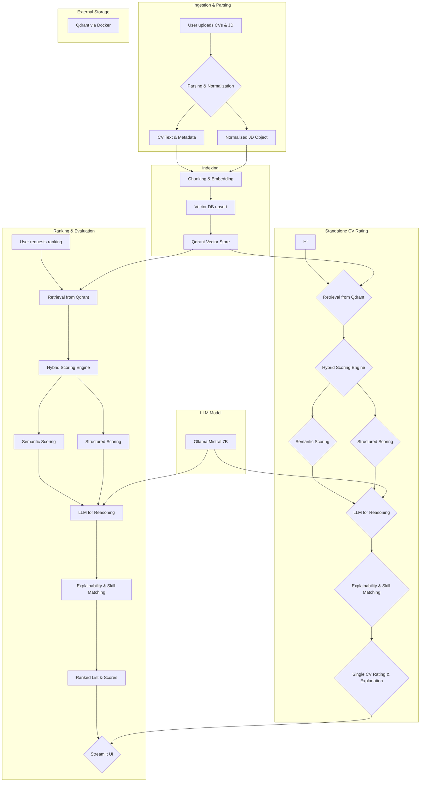

 
# IntelliHire AI

IntelliHire AI is an **AI-powered CV evaluation & ranking system** that understands a job description (JD) and evaluates multiple CVs against that JD — producing ranked lists, per-CV ratings, and explainable reasoning.  
Built for **local-first** execution with **Mistral 7B (Ollama)** for reasoning, **LangChain** for orchestration, and **Qdrant** (via Docker) for vector storage.  

**Key Features:**
- Parse CVs (PDF/DOCX/TXT) & Job Descriptions (free-form text).
- Embed CVs & JDs, then retrieve and compare semantically via RAG.
- **Hybrid scoring engine** combining embeddings + structured matching.
- Batch-rank CVs for a JD and produce explainable scores with matched/missing skill lists.
- Rate a single CV against a JD (ad-hoc rating).
- Evaluate ranking performance with standard IR metrics.
- Streamlit-based interactive UI.

> Local-first: runs on your laptop/device with Ollama + Qdrant — no cloud APIs required.

---

## **Folder Structure**


```
intellihire-ai/
│
├── app/
│ ├── ingestion/ # CV & JD ingestion and parsing
│ │ ├── parse_cv.py # parse PDF/DOCX/TXT -> raw text + metadata
│ │ ├── parse_jd.py # normalize free-form JD text -> canonical JD object
│ │ └── ocr_utils.py # tesseract wrapper + image helpers
│ │
│ ├── pipelines/ # High-level pipelines
│ │ ├── ingest_pipeline.py # text -> chunk -> embed -> upsert
│ │ ├── batch_ranker.py # JD vs. multiple CVs -> ranked results
│ │ └── cv_rater.py # rate a single CV
│ │
│ ├── embeddings/ # Embedding generation & config
│ │ ├── embedder.py # async embedding interface (pluggable)
│ │ └── model_config.py
│ │
│ ├── scoring/ # Scoring engine
│ │ ├── hybrid_scorer.py # combine semantic + structured scoring
│ │ ├── semantic_scorer.py # embedding similarity scoring
│ │ ├── structured_scorer.py # skills, experience, education match
│ │ ├── aggregator.py # ML-based weighting (XGBoost/logistic regression)
│ │ └── prompts.py # prompts for reasoning & explainability
│ │
│ ├── explainability/ # Explainable AI outputs
│ │ ├── skill_matcher.py # extract & normalize matched/missing skills
│ │ ├── highlighter.py # highlight matched text in CV
│ │ └── reason_generator.py # LLM-generated explanation strings
│ │
│ ├── evaluation/ # Ranking performance evaluation
│ │ ├── metrics.py # NDCG, Precision@K
│ │ ├── benchmark_dataset.py # synthetic labeled CV/JD pairs
│ │ └── compare_baselines.py # vs keyword matching baseline
│ │
│ ├── retrieval/ # RAG retrieval helpers
│ │ ├── retriever.py
│ │ └── filters.py
│ │
│ ├── storage/ # Vector DB interactions
│ │ ├── qdrant_client.py
│ │ ├── schema.py
│ │ └── upsert.py
│ │
│ ├── ui/ # Streamlit UI
│ │ ├── streamlit_app.py
│ │ └── components/
│ │ ├── file_uploader.py
│ │ ├── result_card.py
│ │ └── skill_gap_view.py
│ │
│ └── config/ # Config
│ ├── settings.py
│ └── constants.py
│
├── data/ # Demo data
│ ├── samples/cvs/
│ ├── samples/jds/
│ └── benchmark/
│
├── scripts/ # CLI tools
│ ├── init_qdrant.py
│ ├── ingest_jd.py
│ ├── ingest_cvs.py
│ ├── run_batch_ranking.py
│ ├── rate_cv.py
│ ├── run_demo.py
│ └── evaluate_model.py
│
├── tests/ # Unit & integration tests
│ ├── test_ingest.py
│ ├── test_embeddings.py
│ ├── test_ranking.py
│ ├── test_explainability.py
│ └── test_end_to_end.py
│
├── docs/
│ ├── ARCHITECTURE.md
│ ├── PROMPTS.md
│ └── EVALUATION.md
│
├── requirements.txt
├── README.md
├── .env.example
├── .gitignore
└── LICENSE
```


